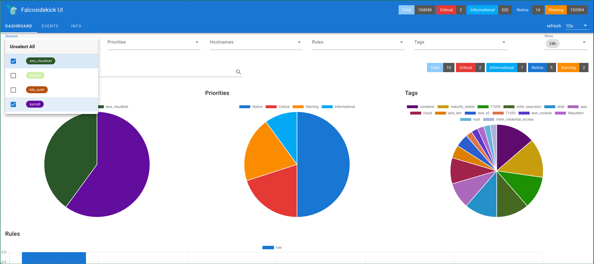

<p align="center"></p>
<p align="center"><b>Terraform Module for Falco AWS Resources.</b></p>

# Terraform Module for Falco AWS Resources
[](https://github.com/falcosecurity/evolution/blob/main/REPOSITORIES.md#ecosystem-scope) [](https://github.com/falcosecurity/evolution/blob/main/REPOSITORIES.md#incubating)

## Quick Start

The [examples/single-account](./examples/single-account) directory can be used to create self-contained AWS Resources (Cloudtrail + S3 + SNS + SQS) that track cloud events and make them accessible to the [cloudtrail](https://github.com/falcosecurity/plugins/tree/master/plugins/cloudtrail) plugin:

```shell
$ aws configure get region
<some aws region e.g. us-east-1, eu-west-1>
$ aws sts get-caller-identity
{
    "UserId": "XXXX",
    "Account": "NNNNN",
    "Arn": "arn:aws:iam::NNNN:YYYYY"
}
$ cd examples/single-account
$ terraform init
$ terraform validate
$ terraform apply
...
Apply complete! Resources: 14 added, 0 changed, 0 destroyed.

Outputs:

cloudtrail_sns_subscribed_sqs_arn = "arn:aws:sqs:ZZZZ"
cloudtrail_sns_subscribed_sqs_url = "https://sqs.<REGION>.amazonaws.com/.../<QUEUE NAME>"
```

The `<QUEUE_NAME>` can then be used in the cloudtrail configuration for the `open_params` value:

```yaml
plugins:
  - name: cloudtrail
    library_path: libcloudtrail.so
    init_config: ""
    open_params: "sqs://<QUEUE NAME>"
...
load_plugins: [cloudtrail]
```

## Documentation

See `README.md` in [examples/single-account](./examples/single-account) or any of the `modules/*` subdirectories.

## Advanced full EKS

If you want to deploy the falco agent as part of an EKS cluster, configure the above [cloudtrail](https://github.com/falcosecurity/plugins/tree/main/plugins/cloudtrail) plugin + [k8saudit-eks](https://github.com/falcosecurity/plugins/tree/main/plugins/k8saudit-eks) and visualize the events with [Falcosidekick](https://github.com/falcosecurity/falcosidekick) check the [examples/single-account-full-eks](./examples/single-account-full-eks/README.md) module.


