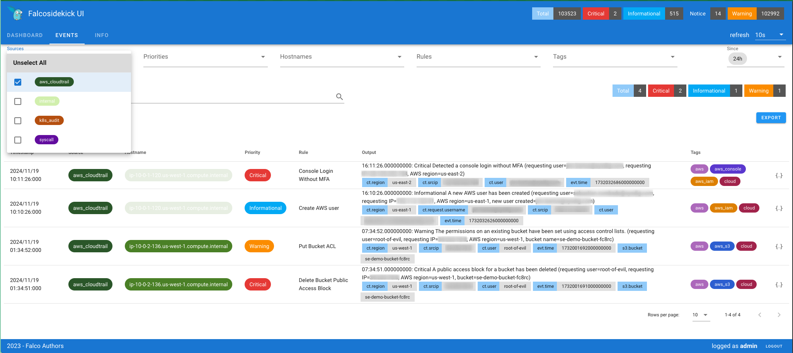

# Deploy Falco Agent in an EKS cluster with the configuration of Cloudtrail and EKS-audit logs in AWS<br/>[ Example :: Single-Account ]

This example module will configure the following infrastructure:

* An EKS cluster
* A [Falco](https://github.com/falcosecurity/falco) agent installation for each of the worker nodes
* A falco [cloudtrail](https://github.com/falcosecurity/plugins/tree/master/plugins/cloudtrail) plugin
* A falco [k8saudit-eks](https://github.com/falcosecurity/plugins/tree/main/plugins/k8saudit-eks) plugin
* A [Falcosidekick](https://github.com/falcosecurity/falcosidekick) daemon for event visualizations

All the required resources and workloads will be run under the same account.

## Prerequisites

Minimum requirements:

1. Configure [Terraform **AWS** Provider](https://registry.terraform.io/providers/hashicorp/aws/latest/docs)
2. Modify the remote state backend config to store your tfstate and persist your infrastructure following best practices. By default the terraform state and configuration will be stored locally. Refer to the [Backend configuration docs](https://developer.hashicorp.com/terraform/language/backend).

## Notice

* **Resource creation inventory** Find all the resources created by this example in the resource-group `falcosecurity-for-cloud` (AWS Resource Group & Tag Editor) <br/><br/>
* **Deployment cost** This example will create resources that cost money.<br/>Run `terraform destroy` when you don't need them anymore


## Usage

For quick testing, use this snippet on your terraform files

```terraform
terraform {
   required_providers {
   }
}

provider "aws" {
   region = "<AWS-REGION>; ex. us-east-1"
}

module "falcosecurity_for_cloud_aws_single_account_full-eks" {
   source = "falcosecurity/falcosecurity-for-cloud/aws/examples/single-account-full-eks"
}
```

See [inputs summary](#inputs) or module [`variables.tf`](https://github.com/falcosecurity/falco-cloudtrail-terraform/blob/master/examples/single-account-full-eks/variables.tf) file for more optional configuration.

To run this example you need have your [aws account profile configured in CLI](https://docs.aws.amazon.com/cli/latest/userguide/cli-configure-profiles.html) and to execute:
```terraform
$ terraform init
$ terraform plan
$ terraform apply
```

## Result

> Check the following Terraform outputs: `kubeconfig` and `get_falcosidekick_local` so you can get the kubeconfig in your local env and then to port-forward the falcosidekick-ui and navigate to <http://localhost:30282> to check the events

Once the EKS cluster is up and running you can run the following kubectl commands to confirm all looks good.

```bash
✦  kubectl -n falco get pods
NAME                                     READY   STATUS    RESTARTS   AGE
falco-86hm5                              2/2     Running   0          18h
falco-falcosidekick-69dbb8c9dc-5kwd7     1/1     Running   0          18h
falco-falcosidekick-ui-7bbfd79c5-88ddj   1/1     Running   0          18h
falco-falcosidekick-ui-redis-0           1/1     Running   0          18h
falco-qggng                              2/2     Running   0          18h
k8saudit-falco-74b478c994-9g6rj          2/2     Running   0          18h
```

You will see one full installation of the falco agent as a daemonset with the driver enabled for the collection of syscalls and container metadata. The `falco-***` pods.
And the `k8saudit-falco-***` falco deployment with just one replica and just the `k8saudit-eks` plugin enabled. The reason is that when running Falco with the `k8saudit-eks` plugin in a kubernetes cluster, you can't have more than 1 pod at once. The plugin pulls the logs from Cloudwatch Logs, having multiple instances will lead to multiple gatherings of the same logs and the duplication of alerts.

To get more details of the current falco configuration check the [falco-config](./falco-config/) dir for the `values.yaml` parameters used.

To locally expose the falcosidekick UI, you can run:

```bash
kubectl -n falco port-forward service/falco-falcosidekick-ui 30282:2802
```

And once you navigate in your local browser to `localhost:30282` you will get the following UI.



By default the login creds are `admin:admin`. You can change that here:

```yaml
# examples/single-account-full-eks/falco-config/falco-values.yaml
falcosidekick:
  enabled: true
  webui:
		...
		# -- User in format <login>:<password>
		user: "moreSecureadmin:moreSecureadmin"
```

## Observations

* For the EKS cluster by default it will configure a new VPC, if you have your own, you can skip that module and pass the `vpc_id` and `subnets` inputs.
* By default the EKS cluster will create an access entry for the user/role that is used to create the cluster. You can add more entries by using the `acces_entries` input for the EKS module.
* By default the Kubernetes API server endpoint access is public, so you can easily run kubectl commands. But you can change that using the `cluster_endpoint_public_access` and `cluster_endpoint_public_access_cidrs` inputs. Check the EKS module for more details.

<!-- BEGIN_TF_DOCS -->
## Providers

| Name | Version |
|------|---------|
| <a name="provider_aws"></a> [aws](#provider\_aws) | 5.83.1 |
| <a name="provider_helm"></a> [helm](#provider\_helm) | 2.16.1 |
| <a name="provider_kubernetes"></a> [kubernetes](#provider\_kubernetes) | 2.33.0 |

## Requirements

| Name | Version |
|------|---------|
| <a name="requirement_terraform"></a> [terraform](#requirement\_terraform) | >= 0.15.0 |
| <a name="requirement_aws"></a> [aws](#requirement\_aws) | >= 5.0.0 |
| <a name="requirement_cloudinit"></a> [cloudinit](#requirement\_cloudinit) | ~> 2.3.0 |
| <a name="requirement_helm"></a> [helm](#requirement\_helm) | ~> 2.16.0 |
| <a name="requirement_kubernetes"></a> [kubernetes](#requirement\_kubernetes) | ~> 2.33.0 |
| <a name="requirement_null"></a> [null](#requirement\_null) | ~> 3.2.0 |
| <a name="requirement_random"></a> [random](#requirement\_random) | ~> 3.6.0 |
| <a name="requirement_time"></a> [time](#requirement\_time) | ~> 0.12.0 |
| <a name="requirement_tls"></a> [tls](#requirement\_tls) | ~> 4.0.0 |

## Usage

The basic usage of this module is as follows:

```hcl
module "example" {
	 source  = "<module-path>"

	 # Optional variables
	 aws_region  = "us-west-1"
	 cloudtrail_is_multi_region_trail  = true
	 cloudtrail_kms_enable  = true
	 cloudtrail_sns_arn  = "create"
	 name  = "ffc"
	 tags  = {
  "product": "falcosecurity-for-cloud"
}
}
```

## Resources

| Name | Type |
|------|------|
| [aws_iam_policy.falco](https://registry.terraform.io/providers/hashicorp/aws/latest/docs/resources/iam_policy) | resource |
| [helm_release.falco](https://registry.terraform.io/providers/hashicorp/helm/latest/docs/resources/release) | resource |
| [helm_release.k8saudit](https://registry.terraform.io/providers/hashicorp/helm/latest/docs/resources/release) | resource |
| [kubernetes_storage_class.gp3](https://registry.terraform.io/providers/hashicorp/kubernetes/latest/docs/resources/storage_class) | resource |

## Inputs

| Name | Description | Type | Default | Required |
|------|-------------|------|---------|:--------:|
| <a name="input_aws_region"></a> [aws\_region](#input\_aws\_region) | AWS region to deploy resources | `string` | `"us-west-1"` | no |
| <a name="input_cloudtrail_is_multi_region_trail"></a> [cloudtrail\_is\_multi\_region\_trail](#input\_cloudtrail\_is\_multi\_region\_trail) | true/false whether cloudtrail will ingest multiregional events | `bool` | `true` | no |
| <a name="input_cloudtrail_kms_enable"></a> [cloudtrail\_kms\_enable](#input\_cloudtrail\_kms\_enable) | true/false whether cloudtrail delivered events to S3 should persist encrypted | `bool` | `true` | no |
| <a name="input_cloudtrail_sns_arn"></a> [cloudtrail\_sns\_arn](#input\_cloudtrail\_sns\_arn) | ARN of a pre-existing cloudtrail\_sns. If defaulted, a new cloudtrail will be created | `string` | `"create"` | no |
| <a name="input_name"></a> [name](#input\_name) | Name to be assigned to all child resources. A suffix may be added internally when required. Use default value unless you need to install multiple instances | `string` | `"ffc"` | no |
| <a name="input_tags"></a> [tags](#input\_tags) | falcosecurity-for-cloud tags. always include 'product' default tag for resource-group proper functioning | `map(string)` | <pre>{<br>  "product": "falcosecurity-for-cloud"<br>}</pre> | no |

## Modules

| Name | Source | Version |
|------|--------|---------|
| <a name="module_cloudtrail"></a> [cloudtrail](#module\_cloudtrail) | ../../modules/infrastructure/cloudtrail | n/a |
| <a name="module_eks_cluster"></a> [eks\_cluster](#module\_eks\_cluster) | ../../modules/infrastructure/eks | n/a |
| <a name="module_irsa"></a> [irsa](#module\_irsa) | terraform-aws-modules/iam/aws//modules/iam-role-for-service-accounts-eks | ~> 5.38 |
| <a name="module_resource_group"></a> [resource\_group](#module\_resource\_group) | ../../modules/infrastructure/resource-group | n/a |
| <a name="module_sqs_sns_subscription"></a> [sqs\_sns\_subscription](#module\_sqs\_sns\_subscription) | ../../modules/infrastructure/sqs-sns-subscription | n/a |
| <a name="module_vpc"></a> [vpc](#module\_vpc) | ../../modules/infrastructure/vpc | n/a |

## Outputs

| Name | Description |
|------|-------------|
| <a name="output_cloudtrail_sns_subscribed_sqs_arn"></a> [cloudtrail\_sns\_subscribed\_sqs\_arn](#output\_cloudtrail\_sns\_subscribed\_sqs\_arn) | ARN of the cloudtrail-sns subscribed sqs |
| <a name="output_cloudtrail_sns_subscribed_sqs_url"></a> [cloudtrail\_sns\_subscribed\_sqs\_url](#output\_cloudtrail\_sns\_subscribed\_sqs\_url) | URL of the cloudtrail-sns subscribed sqs |
| <a name="output_get_falcosidekick_local"></a> [get\_falcosidekick\_local](#output\_get\_falcosidekick\_local) | Command to get the falcosidekick UI via port-forward |
| <a name="output_kubeconfig"></a> [kubeconfig](#output\_kubeconfig) | Commands to get the kubeconfig |
<!-- END_TF_DOCS -->

## Authors

This was originally based on the [Terraform](https://github.com/sysdiglabs/terraform-aws-secure-for-cloud) module for Sysdig Secure.

## License

Apache 2 Licensed. See LICENSE for full details.
